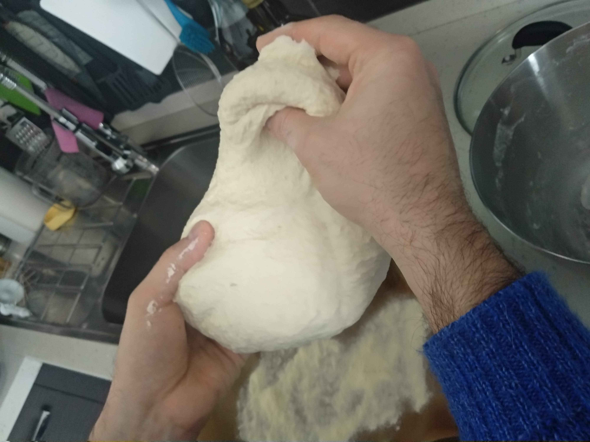
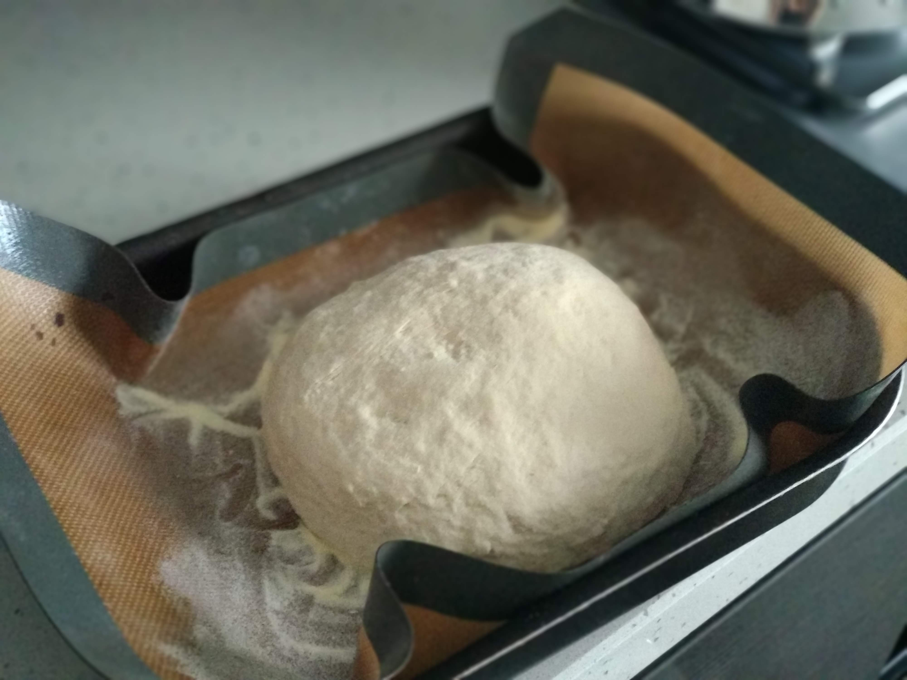

# Pane (con lievito madre)

**Tempo di preparazione**: 15 min (escludendo il tempo di riposo e lievitazione) + 40 minuti di cottura

**Porzioni**: Dipende da quanto pane mangi :)

**Difficoltà**: semplice, con la planetaria

## Ingredienti

Per rinfrescare il lievito: 
- lievito madre *200g*
- farina 0 *200g*
- acqua tiepida *200g*
- 1 cucchiaio di zucchero

Per il pane:
- Metà del lievito rinfrescato
- farina 0 *400g*
- semola *200g*
- acqua tiepida *200g*
- 1 cucchiaio di olio d'oliva
- sale *15 / 20g*

## Preparazione

1. Riempire il recipiente della planetaria con il lievito, 200 g di acqua tiepida, 200 g di farina 0 e mescolare con un cucchiaio di zucchero (contribuisce alla lievitazione). Lasciar riposare al caldo finché non si nota un deciso aumento di volume (dipende dal tipo di lievito, per alcuni sono necessarie anche 8 ore)

2. Quando il lievito è pronto, metterne via circa 200 g per la prossima volta che si fa il pane

3. Aggiungere la farina 0 e la semola, l'olio e il sale. Mescolare con un cucchiaio

4. Mettere l'impasto nella planetaria e aggiungere acqua un po' per volta

5. Lasciare impastare per almeno 15 minuti

6. Aggiustare l'impasto con le mani ripiegandolo su sè stesso, in modo da creare un po' di aria tra le pieghe ed avendo cura di non rompere troppo la "pellicola" esterna

7. Lasciar lievitare al caldo a piacere (una notte intera, 8 ore)

8. Cuocere in forno statico per 40 minuti a 200°, finché il pane non forma una crosta dorata

## Note

Con maggiori percentuali di semola è necessaria una lievitazione più lunga se si usa solo lievito madre, oppure è necessario integrare con lievito di birra.

Prima di infornare il pane si possono fare dei tagli con le forbici sulla superficie per decorarlo o dargli una forma meno regolare.
