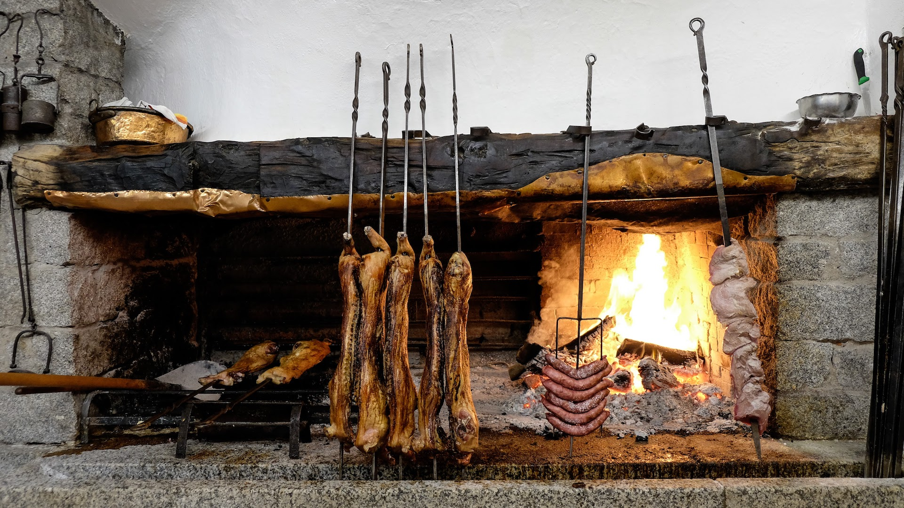

# Maialetto sardo

Il maialetto sardo si prepara con maialetti da latte del peso di circa 7kg, tradizionalmente cotto su uno spiedo tenuto in piedi davanti al caminetto e girato di tanto in tanto.

**Tempo di preparazione**: 2 ore 30 minuti

**Porzioni**: 4

**Difficoltà**: semplice

## Ingredienti

- Maialetto da latte, *1 quarto*
- Rametti di mirto, *q.b.*
- Sale, *q.b.*

## Preparazione

1. Ricoprire il quarto di maialetto di sale, massaggiandolo per farlo attaccare alla cotenna e alla carne

2. Ricoprire di carta da forno una teglia, mettere qualche rametto di mirto sulla teglia e adagiarvi il maialetto con la cotenna rivolta verso l'alto

3. Cuocere il maialetto per 30-45 minuti in forno statico pre riscaldato a 160°C

4. Continuare la cottura con il forno al massimo (220-250°C)

5. Ultimare la cottura con 30 minuti di grill

6. Tagliare la carne con un trinciapollo, prestando attenzione a non spezzare le ossa. Servire in una grande teglia mescolando la carne alle foglie di mirto per insaportire.

## Note

Il maialetto non va mai girato per rendere la cotenna croccante. 

Per verificare la cottura, inserire a fondo la lama di un coltello e rimuoverlo subito: se la punta del coltello è calda la carne sarà ben cotta.