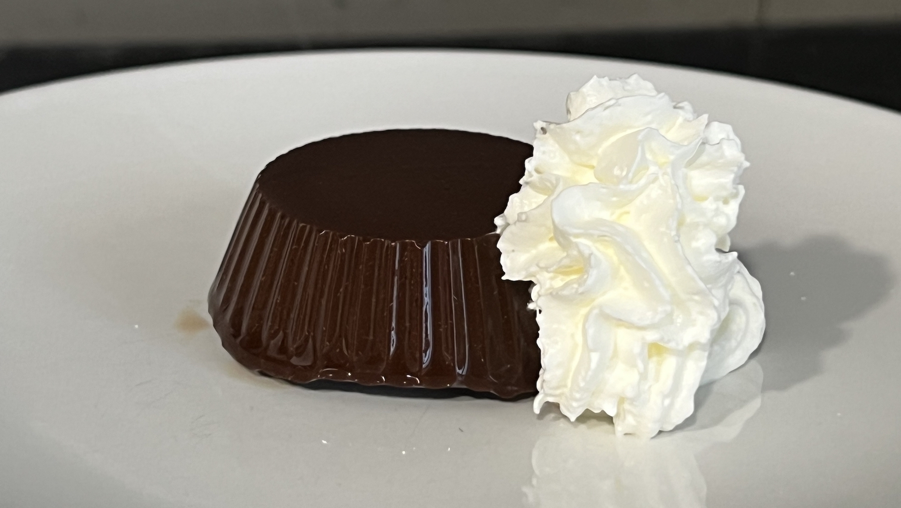

# Budino di cachi (vegano)

## Ingredienti

- cachi
- cacao

## Preparazione

Dosare *10g* di cacao ogni *100g* di polpa di cachi. 
Frullare per 2/3 minuti fino a rendere il composto omogeneo.
Trasferire il composto in uno stampo o in pirottini per porzioni singole.
Far riposare in frigo per almeno 3/4 ore.

Guarnire a piacere con panna montata.